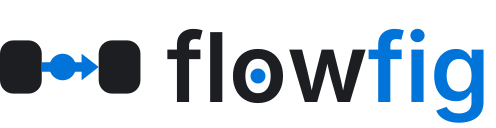
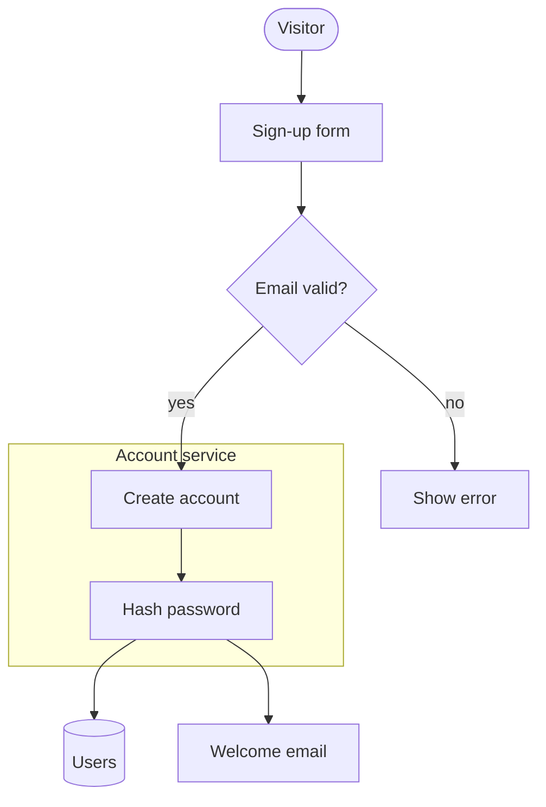

<div align="center">

<h1></h1>

### Your coding agent draws the diagram from your code. flowfig checks it, and CI fails when the linked code is gone.

<p>
  <a href="https://www.npmjs.com/package/flowfig"></a>
  <a href="https://github.com/iamalvisng/flowfig/actions/workflows/ci.yml"></a>
  <a href="LICENSE"></a>
  
  
</p>


</div>

## The problem

A diagram in a repo drifts from the code. Someone renames a function, and the diagram still shows the old name. No
check fails, so no one sees the drift.

flowfig links each part of a diagram to the code that it draws. `flowfig verify` fails when a linked file or symbol is
gone, and warns when the code does not make an edge. Run `verify` in CI, and a stale diagram fails the pull request.

## Fail CI when the diagram drifts

A box, an edge or a message can name the code that it draws:

```json
{ "id": "verify", "label": "verifyPassword", "source": "src/auth/login.ts#verifyPassword" }
```

Rename `verifyPassword` to `checkPassword`. Then `verify` fails with exit code 1:

```console
$ npx flowfig verify login.svg
error    missing-symbol     login.svg: box "verify" -> src/auth/login.ts#verifyPassword: symbol not defined
1 error, 0 warnings
login.svg: 0 of 1 boxes defined
```

`verify` checks that each linked file exists and that it defines the symbol. It also checks each edge against the code
(see [Verify in CI](#verify-in-ci)). A link to a Markdown file can name a heading, so a process diagram can follow its SOP
document.

The GitHub Action runs `verify` on every figure in a pull request. For each SVG that the PR changes, it comments the old
image, the new image and the spec changes. It also names each figure whose linked code the PR changes.

```yaml
# .github/workflows/figures.yml
name: figures
on: pull_request
jobs:
  figures:
    runs-on: ubuntu-latest
    permissions:
      contents: read
      pull-requests: write
    steps:
      - uses: actions/checkout@v4
        with:
          fetch-depth: 0 # the Action reads the old figure from the base commit
      - uses: actions/setup-node@v4
        with:
          node-version: 22
      - uses: iamalvisng/flowfig@v0.9.0
        with:
          figures: 'docs/**/*.svg' # default **/*.svg
```

## Use it

Set up your repo:

```bash
npx flowfig init
```

Then start a new agent session. In Claude Code, run:

```
/figure how does login work
```

With any agent, ask in plain words:

```
draw a diagram of how login works in this repo
use flowfig to draw the checkout flow as a sequence
draw the refund process with a lane for each team
```

The agent writes an SVG and ends its reply with `npx flowfig open <path>`. Run that command to see the animation in your
browser.

`init` sets up 7 agents: Claude Code, Cursor, GitHub Copilot, Codex and other `AGENTS.md` agents, Gemini CLI, Windsurf
and Kiro.

## One command

```bash
npx flowfig draw "how does login work"
```

`draw` runs Claude Code on the repo with the flowfig guide. It gives Claude Code the tools Read, Glob and Grep, and
`npx flowfig`. `draw` disallows the tools Edit, MultiEdit and NotebookEdit. Claude Code writes the figure. Then `draw`
checks the figure with `check --strict` and `verify`. `draw` prints the result, the reply of the agent and the cost of
the run.

`draw` needs Claude Code on the machine and a login. `draw` does not run on Windows yet. `--out` sets the path,
`--model` sets the model, `--max-turns` sets the turn cap (default 40), `--json` prints the result for scripts, and
`--open` opens the figure.

## How it works

1. **The agent writes JSON, not pictures.** The agent reads the code and writes a spec of the parts, the calls and their
   order. flowfig does the layout.
2. **flowfig checks the spec.** `flowfig check` has 26 rules. It finds ids that point nowhere, text wider than its box,
   edges through boxes, overlapping labels and low contrast. A render runs the same check and writes nothing on an error.
   The agent reads the faults and fixes the spec.
3. **The output is one animated SVG with no script.** The SVG plays in a GitHub README, PR or issue. It follows the light
   or dark mode of the reader. The SVG carries its spec, so `npx flowfig --spec figure.svg` prints it back.

## Forms

The map (the default) shows the parts and the messages between them:


The map and the rail (`rail: true`) adds one row for each message, with its payload:


The rail only (`rail: "only"`) shows the order of the messages without the map:


Swimlanes (`lanes: true`) give each role a lane and put the steps left to right in time order:


A long swimlane process wraps into blocks at the page width. An edge between two blocks becomes two labeled stubs:



The timeline (`timeline: true`) draws a roadmap with one track per team, dated bars, milestones and a today line:


A state lifecycle marks the first state with `mark: "start"` and each final state with `mark: "end"`:


## Open and share

`npx flowfig open figure.svg` shows the figure in your default browser.

`npx flowfig gif figure.svg` writes an animated GIF for Slack, Notion, X and slides, where SVG animation does not play.

The options are in [Open and share a figure](#open-and-share-a-figure).

## flowfig, Mermaid and a hand-drawn image

|                                | flowfig                           | Mermaid                              | Hand-drawn image |
| ------------------------------ | --------------------------------- | ------------------------------------ | ---------------- |
| Made by an agent from the code | Yes, with the `init` instructions | Yes, as Mermaid text                 | No               |
| Linked to the code             | Yes, `verify` fails in CI         | No                                   | No               |
| Checked for faults             | Yes, 26 rules in `flowfig check`  | Syntax errors only                   | No               |
| Animated                       | Yes, one packet per message       | No                                   | No               |
| Shows payloads and order       | Yes, on the map and the rail      | Order and text in a sequence diagram | No               |
| Plays in a GitHub README       | Yes, as an SVG                    | Yes, GitHub renders it               | Yes, as an image |
| Readable back as source        | Yes, with `--spec`                | Yes, the source is text              | No               |
| Class and ER diagrams          | No                                | Yes. Mermaid wins this row.          | Yes              |

## Contents

- [Install](#install)
- [Your first figure](#your-first-figure)
- [Read and change a figure](#read-and-change-a-figure)
- [The spec](#the-spec)
- [Check a figure](#check-a-figure)
- [Open and share a figure](#open-and-share-a-figure)
- [Verify in CI](#verify-in-ci)
- [Trace the calls of a function](#trace-the-calls-of-a-function)
- [Find stale figures](#find-stale-figures)
- [One page for all figures](#one-page-for-all-figures)
- [Convert Mermaid](#convert-mermaid)
- [MCP server](#mcp-server)
- [Use in React](#use-in-react)
- [Use from Node](#use-from-node)
- [Use with your coding agent](#use-with-your-coding-agent)
- [What flowfig does not draw](#what-flowfig-does-not-draw)
- [License](#license)
- [Development](#development)

## Install

```bash
npm i flowfig
```

React (>=18) is a peer dependency. Only the React player needs React. The CLI and `flowfig/svg` do not need React. flowfig needs
Node 18 or later.

## Your first figure

Save this spec as `first.json`. The spec has 3 boxes, 2 edges and 1 step.

```json
{
  "layout": {
    "children": [
      { "id": "browser", "label": "Browser" },
      { "id": "api", "label": "API" },
      { "id": "db", "label": "Database", "shape": "store" }
    ]
  },
  "edges": [
    { "from": "browser", "to": "api", "label": "GET /user" },
    { "from": "api", "to": "db", "label": "read the user" }
  ],
  "steps": [
    {
      "label": "Load a user",
      "flow": [
        { "edges": "browser->api", "say": "The browser asks the API for the user." },
        { "edges": "api->db", "say": "The API reads the row." },
        { "edges": { "edge": "api->db", "back": true }, "say": "The row comes back." },
        { "edges": { "edge": "browser->api", "back": true }, "say": "The API sends the user as JSON." }
      ]
    }
  ]
}
```

Render the spec:

```console
$ npx flowfig first.json
0 errors, 0 warnings
figure: 3 boxes, 0 groups, 2 edges, 1 step, 4 messages
browser -> api: GET /user
api -> db: read the user
step "Load a user": 4 hops
alt: Flow figure: Browser, API, Database. Steps: Load a user.
first.svg — 10.1 kB
```

The render prints the check result, the counts, one line per edge and one line per step. Read these lines to check the figure
without a second command. If a box or an edge has a `source` or a `via`, the render also prints the `verify` counts.
`--no-verify` skips them.

The command writes `first.svg`:


The SVG has no script and fetches no font. GitHub shows the SVG in a README, a PR or an issue. The SVG follows the light or dark
color scheme of the reader.

## Read and change a figure

Each SVG from the CLI carries its own spec. These commands made the rail-only figure from `docs/checkout.svg`:

```bash
npx flowfig --spec docs/checkout.svg > checkout.json   # print the spec in the SVG
# edit checkout.json: set "props.rail" to "only"
npx flowfig checkout.json docs/checkout-rail-only.svg
npx flowfig verify docs/checkout.svg                    # check each source and each edge against the code
npx flowfig diff old.svg docs/checkout.svg              # list what changed in the spec
npx flowfig diff old.svg docs/checkout.svg --svg diff.svg   # draw the change in one figure
```

The diff SVG is a still figure. Green marks an added box or edge, red and dashed marks a removed one, and orange marks a changed one.
The diff SVG has no spec. The Action and `coverage` skip it. `verify` and `--spec` report that it has no spec.

## The spec

A spec has a `layout`, `edges`, and optional `steps`. The full types have doc comments, so your editor shows each field. For the
full reference, run `npx flowfig docs`.

### Boxes

| Field    | Meaning                                                                                                   | Default                             |
| -------- | --------------------------------------------------------------------------------------------------------- | ----------------------------------- |
| `id`     | The name that edges and steps use. It must be unique.                                                     | required                            |
| `label`  | The title in the box.                                                                                     | required                            |
| `sub`    | A smaller line under the label.                                                                           | none                                |
| `shape`  | `"box"`, `"decision"` (a diamond) or `"store"` (a data cylinder).                                         | `"box"`                             |
| `source` | The code this draws: `path` or `path#symbol`. `flowfig verify` checks it.                                 | none                                |
| `detail` | A more detailed figure: the SVG path from the repo root. `flowfig atlas` links the box to it.             | none                                |
| `lines`  | The least number of text lines that a content card keeps.                                                 | none                                |
| `width`  | The width in px. This value replaces the width that layout picks.                                         | from layout                         |
| `at`     | In a `lanes` figure: the time column of the box, from 0.                                                  | the order of first use in the steps |
| `from`   | In a `timeline` figure: the start date of the item, as YYYY-MM-DD. A box with only `from` is a milestone. | none                                |
| `to`     | In a `timeline` figure: the last day of the item, as YYYY-MM-DD.                                          | none                                |
| `mark`   | `"start"` draws a dot before the box. `"end"` draws a ring after the box. Use it on a state lifecycle.    | none                                |

### Groups

`layout` is a group. A group holds boxes and other groups.

| Field       | Meaning                                                                                                  | Default                                             |
| ----------- | -------------------------------------------------------------------------------------------------------- | --------------------------------------------------- |
| `children`  | The boxes and groups in the group, in order.                                                             | required                                            |
| `id`        | The name that an edge can use to reach the whole group.                                                  | none                                                |
| `label`     | The title of the frame. Only a group with a label has a frame.                                           | none                                                |
| `direction` | `"row"` puts the children side by side. `"column"` stacks them.                                          | `"row"`                                             |
| `gap`       | The smallest space between the children in px. It grows to fit the labels of edges that cross the group. | column: 28; row: fits the widest label, at least 56 |
| `align`     | `"start"`, `"center"` or `"end"`, across the direction.                                                  | `"center"` (a column stretches)                     |
| `auto`      | On the root layout: `true` makes flowfig place the boxes. See [Automatic layout](#automatic-layout).     | off                                                 |

### Automatic layout

Set `"auto": true` on the root layout and list the boxes. flowfig places them in ranks, in the direction of the edges.
Use it when you do not want to plan rows and columns, or when `check` reports an edge through a box.

```json
{
  "layout": {
    "auto": true,
    "children": [
      { "id": "api", "label": "API" },
      { "id": "queue", "label": "Queue", "shape": "store" },
      { "label": "Workers", "children": [{ "id": "w", "label": "Worker" }] }
    ]
  },
  "edges": [
    { "from": "api", "to": "queue", "label": "enqueue" },
    { "from": "queue", "to": "w", "label": "pull" }
  ]
}
```

Render the spec with `npx flowfig spec.json docs/auto-layout.svg`. This figure has 9 boxes, 1 frame, 1 decision, 1 store and 2 steps:


A group with a `label` or an `id` stays together as one frame. flowfig removes a group with neither, with its `direction`, `gap`
and `align`. flowfig ignores `around` on the edges. A `direction` on the root forces `"row"` or `"column"`. `lanes` and
`timeline` figures ignore `auto`.

### Edges

| Field    | Meaning                                                                                             | Default    |
| -------- | --------------------------------------------------------------------------------------------------- | ---------- |
| `from`   | The id of the box or group where the edge starts.                                                   | required   |
| `to`     | The id of the box or group where the edge ends.                                                     | required   |
| `id`     | The name that beats use.                                                                            | `from->to` |
| `label`  | The text on the edge.                                                                               | none       |
| `around` | `"above"`, `"below"`, `"left"` or `"right"` routes the edge around the boxes between, on that side. | none       |
| `quiet`  | `true` draws the edge only while a step uses it.                                                    | `false`    |
| `source` | The code this edge draws: `path` or `path#symbol`. `flowfig verify` checks it.                      | none       |

### Steps

Each step is one story. The player shows one tab for each step. With no steps, the figure is a still map.

| Field     | Meaning                                               | Default  |
| --------- | ----------------------------------------------------- | -------- |
| `label`   | The tab title.                                        | required |
| `flow`    | The beats, in play order.                             | required |
| `caption` | The line under the figure while no beat has a `say`.  | none     |
| `nodes`   | The ids of the boxes to highlight for the whole step. | none     |

### Beats

A beat is an edge id, an array of edge ids that run at the same time, or an object:

| Field   | Meaning                                                                                    | Default        |
| ------- | ------------------------------------------------------------------------------------------ | -------------- |
| `edges` | One hop or an array of hops. A hop is an edge id or `{ edge, back, data, async, source }`. | none (a pause) |
| `say`   | The line of narration for the beat.                                                        | none           |
| `show`  | `{ boxId: content }` fills the content card of a box until the step ends.                  | none           |
| `light` | The ids of the boxes to highlight for this beat only.                                      | none           |
| `ms`    | The length of the beat in ms.                                                              | `speed` (900)  |

In a hop, `back: true` runs the packet from `to` to `from`. `data` is a small card on the packet. `async: true` marks a message
that does not wait for an answer. On the rail, an `async` hop has a dashed arrow and an `async` tag. The hops of one beat
share a parallel band on the rail.

Content is an array of rows, or a React node in the player. A row is `{ text, tag, tone, meta, mark, mono }`. Only `text` is
required. The tones are `blue` (the default), `purple`, `green`, `orange` and `gray`.

### Figure options

| Field      | Meaning                                                                              | Default  |
| ---------- | ------------------------------------------------------------------------------------ | -------- |
| `rail`     | `true` draws the rail under the map. `"only"` draws the rail alone.                  | `false`  |
| `lanes`    | `true` draws swimlanes: a `column` group of labeled groups, one lane per role.       | off      |
| `timeline` | `true` draws a timeline: one labeled group per track, with the boxes at their dates. | off      |
| `today`    | In a `timeline` figure: the date of the today line, as YYYY-MM-DD.                   | none     |
| `speed`    | The time in ms for a packet to cross one edge.                                       | 900      |
| `theme`    | `{ accent, fg, muted, bg, surface, border, font }`. Each key is optional.            | built-in |
| `autoplay` | Start to play when the figure mounts. Only the React player reads it.                | `true`   |
| `check`    | Run the check rules in the browser. Only the React player reads it.                  | `false`  |

## Check a figure

`flowfig check` reads a spec and lists the faults. The input is `-` (stdin), a `.json` file, a `.ts` module or an SVG from the
CLI. A `.ts` module needs a Node version that strips types, such as Node 22.18 or later.

```console
$ npx flowfig check docs/checkout.svg
0 errors, 0 warnings
figure: 5 boxes, 3 groups, 4 edges, 2 steps, 6 messages
```

The last line gives the counts of the parts of the figure. Compare the counts with the parts that you planned.

`flowfig check` has 26 rules: 11 errors and 15 warnings.

| Rule                        | Severity | What it finds                                                                                                              |
| --------------------------- | -------- | -------------------------------------------------------------------------------------------------------------------------- |
| `unknown-id`                | error    | An edge, step or beat names a box, group or edge that does not exist.                                                      |
| `duplicate-id`              | error    | Two boxes, two groups or two edges have the same id.                                                                       |
| `hidden-edge`               | error    | A `quiet` edge that no beat uses, so the figure never shows it.                                                            |
| `text-overflow`             | error    | Text that needs more width than its box has.                                                                               |
| `edge-crosses-box`          | error    | An edge that goes through a box that is not one of its ends.                                                               |
| `label-overlap`             | error    | Two edge labels overlap, or a label covers a box or an edge, or a stub label crosses a lane border.                        |
| `low-contrast`              | error    | A text and background pair below 4.5:1, in the light, dark or custom theme, or on a tone tint.                             |
| `lanes-need-column`         | error    | The layout of a `lanes` or `timeline` figure is not a column group of labeled groups.                                      |
| `bad-at`                    | error    | An `at` value that is not an integer of 0 or more.                                                                         |
| `timeline-need-from`        | error    | A box in a timeline has no `from` date.                                                                                    |
| `bad-date`                  | error    | A `from`, `to` or `today` value is not a real YYYY-MM-DD date, or a `to` is before its `from`.                             |
| `empty-step`                | warning  | A step with no beats.                                                                                                      |
| `small-text`                | warning  | At the page width, the smallest text is below the minimum size.                                                            |
| `bad-source`                | warning  | A `source` that is not `path` or `path#symbol`.                                                                            |
| `bad-detail`                | warning  | A `detail` that is not a relative path that ends in `.svg`.                                                                |
| `mark-count`                | warning  | A lifecycle has more than one `start` mark, or a `start` mark and no `end` mark.                                           |
| `lane-column-taken`         | warning  | Two boxes in one lane share a time column.                                                                                 |
| `lane-end-block`            | warning  | In wrapped lanes, an edge ends at a lane that no block on its side shows.                                                  |
| `stub-crosses-edge`         | warning  | In wrapped lanes, a stub line crosses another edge.                                                                        |
| `long-edge`                 | warning  | An edge at least 600 px long that is 1.6 times or more the straight distance between its ends.                             |
| `timeline-dependency-order` | warning  | In a timeline, an item does not start after the item that it depends on ends. An item may start on the day of a milestone. |
| `timeline-and-lanes`        | warning  | The figure sets `timeline` and `lanes`. The renderers draw the timeline and ignore `lanes`.                                |
| `font-estimated`            | warning  | `theme.font` is set. The SVG check estimates text width for the system font.                                               |
| `color-not-checked`         | warning  | A color that the check cannot read, so its contrast is not checked.                                                        |
| `plain-text`                | warning  | Text with a code name, a filler word, or a `say` or caption over 20 words.                                                 |
| `auto-ignored`              | warning  | `auto` with `lanes` or `timeline`, `auto` on a nested group, or `around` on an edge with `auto`.                           |

| Option            | Effect                                                                                                     |
| ----------------- | ---------------------------------------------------------------------------------------------------------- |
| `--strict`        | Every warning becomes an error.                                                                            |
| `--json`          | Print the findings as a JSON array, for scripts. Each finding has `rule`, `severity`, `ids` and `message`. |
| `--width <px>`    | The page width for `small-text` and for the lanes wrap. Default: 830.                                      |
| `--min-text <px>` | The smallest text size the reader must get. Default: 10.                                                   |

The exit code is 0 with no errors, 1 with one or more errors, and 2 for bad use, such as a missing input, an unknown flag, or a `--width` value that is not a number.

A render runs the same check first. If the check finds an error, the render writes nothing. `--no-check` skips the check.

In React, `<Flow check />` runs the same rules on the layout that the browser drew. The player prints each fault with
`console.warn`.

## Open and share a figure

`flowfig open` shows a figure in your default browser. On macOS, an `.svg` file often opens in a text editor or in Xcode. Thus
`open` writes an HTML page that holds the SVG, and opens that page.

```bash
npx flowfig open docs/checkout.svg
npx flowfig open docs/checkout.svg --html checkout.html    # also write the page to checkout.html
npx flowfig docs/checkout.json docs/checkout.svg --open    # render, then open
```

`flowfig gif` writes an animated GIF of the whole loop. A GIF plays in Slack, Notion, X and slide decks, where an SVG
animation does not play.

```bash
npx flowfig gif docs/checkout.svg                 # writes docs/checkout.gif
npx flowfig gif docs/checkout.svg --step 2        # only step 2: writes docs/checkout-step2.gif
npx flowfig gif docs/checkout.svg --dark --mp4    # the dark theme, and also docs/checkout.mp4
```

`gif` needs Chrome, Edge, Chromium or Brave in the standard install path. Set `CHROME_PATH` to use another browser program.
`--fps` sets the frames per second (1 to 50, default 20). `--scale` sets the pixel scale (default 2). `--mp4` needs `ffmpeg`
on the PATH. If a GIF is over 10 MB, `gif` prints a warning. Use `--step`, a lower `--fps` or a lower `--scale` to make the
file smaller.

## Verify in CI

A box, an edge or a hop can name the code it draws: `"source": "src/auth/login.ts#verifyPassword"`. `npx flowfig verify docs/login.svg`
fails when the file or the symbol is gone. The action runs `verify` on every figure in a pull request. It comments the old and
the new image for each SVG the PR changes, with the spec changes as a list, and it names each figure whose linked code the PR
changes.

`verify` prints one count line for each figure, and gives each edge one result:

```console
docs/login.svg: 7 of 7 boxes defined; edges: 9 found, 0 not found, 1 unsure, 1 not checked
```

- found: the caller code calls or references the callee through an import, the same file or a typed receiver.
- not found: the caller code does not. `verify` warns, and `--strict` makes it an error.
- unsure: `verify` cannot decide, for example when a receiver has no declared type. `verify` lists it with the reason. It never fails CI.
- not checked: the edge has no `source`, or the language is not supported.

`verify` also checks `detail`. If the file is missing or has no figure spec, `verify` warns with `missing-detail`. `--strict` makes it an error.

A method source is `path#Owner.name`. An edge `source` names the function that makes the call.

`via` on an edge names the route, queue, topic, table, file or key that both sides use. For a `via` edge, found means that the caller code and the callee file both use that token. It does not prove that a handler serves it.

Edge checks support TypeScript/JavaScript, Python, Go, Java, C# and Rust. Other files keep the name check for boxes.

A process figure for a team links its boxes to the SOP document, not to code: `"source": "docs/sop/refunds.md#step-3-approve-or-reject"`. The symbol is the heading as a GitHub anchor. If the heading is gone, `verify` fails.

```yaml
# .github/workflows/figures.yml
name: figures
on: pull_request
jobs:
  figures:
    runs-on: ubuntu-latest
    permissions:
      contents: read
      pull-requests: write
    steps:
      - uses: actions/checkout@v4
        with:
          fetch-depth: 0 # the Action reads the old figure from the base commit
      - uses: actions/setup-node@v4
        with:
          node-version: 22
      - uses: iamalvisng/flowfig@v0.9.0
        with:
          figures: 'docs/**/*.svg' # default **/*.svg
```

## Trace the calls of a function

`flowfig trace` lists the calls that one function makes, and the calls that those calls make. Ask your coding agent to run it
before it writes a figure. Then the agent reads only the lines that the trace names. Each edge passes the same check as
`verify`.

`src/login.ts`:

```ts
import { verifyPassword } from './password.ts';
import { findUser } from './users.ts';

export function login(name: string, password: string) {
  const user = findUser(name);
  return verifyPassword(user, password);
}
```

`src/password.ts`:

```ts
export function verifyPassword(user: { hash: string }, password: string) {
  return user.hash === password.split('').reverse().join('');
}
```

`src/users.ts`:

```ts
export function findUser(name: string) {
  return { name, hash: 'drowssap' };
}
```

```console
$ npx flowfig trace src/login.ts#login
src/login.ts#login
  5  src/users.ts#findUser
  6  src/password.ts#verifyPassword
summary: 3 symbols, 2 found, 0 unsure, 0 open, 1 call outside the repo, 0.0 s
```

- A header line gives a caller as `file#symbol`. Each call line under it gives the line of the call, then the callee.
  The call is in the file of the caller. A callee in the same file shows only its symbol.
- `unsure`: trace cannot name the target. An example is a call of a parameter.
- `open`: the target is a name in a string, for example a route table entry. Read that line yourself.
- `stop`: the trace reached `--depth` or `--max`. The line gives the number of functions that it did not follow.
- A call into a package or the standard library gives no line. The summary line counts these calls.

A call that trace cannot see gives no line, for example a call through an interface with no known type.
trace reads code as text. In rare cases, two names that look the same can give a wrong edge. `flowfig verify` and your review of the figure still check each edge.

| Option         | Meaning                                            | Default            |
| -------------- | -------------------------------------------------- | ------------------ |
| `--depth <n>`  | The number of call levels to follow.               | 2                  |
| `--max <n>`    | The largest number of edges. Then the trace stops. | 40                 |
| `--root <dir>` | The repo root. The file path is relative to it.    | the current folder |
| `--json`       | Print one JSON object in place of the lines.       | off                |

The exit code is 1 if the file or the function is not found. It is also 1 if the language is not TypeScript,
JavaScript, Python, Go, Java, C# or Rust.

## Find stale figures

`flowfig coverage` reads each figure in the repo and gives it one state. It also shows the code that has no figure. Run
it each week, or in CI.

```console
$ npx flowfig coverage --entries 'src/geometry.ts'
docs/cached-request.svg        ok      3 of 3 boxes defined
docs/checkout-rail-only.svg    ok      4 of 4 boxes defined
docs/checkout.svg              ok      4 of 4 boxes defined
docs/first.svg                 none    no source links
docs/hero.svg                  none    no source links
docs/order-status.svg          none    no source links
docs/refund-process.svg        ok      6 of 6 boxes defined
docs/returns-process.svg       ok      8 of 8 boxes defined
docs/roadmap.svg               ok      8 of 8 boxes defined
uncovered src/geometry.ts: 1 of 1 files have no figure
  src/geometry.ts
summary: 9 figures: 6 ok, 0 stale, 0 fail, 3 none
```

- `fail`: `verify` finds an error, for example a symbol that is gone.
- `stale`: `verify` finds no error, but a linked file changed in a commit after the last commit of the SVG. A linked file
  with changes that are not committed counts as changed now.
- `ok`: `verify` finds no error, and no linked file changed after the SVG.
- `none`: the figure has no `source` link.

`coverage` reads the commit dates from git. If the folder is not in a git repo, `coverage` does not check `stale`. It
prints one line that says so.

A figure covers a code file if one of its links names that file. With `--entries`, `coverage` lists each matched code
file that no figure covers. With no `--entries`, it prints one count line for each top folder.
`coverage` does not count test files as code: `*.test.*`, `*.spec.*`, `__tests__/`, `test_*.py`, `*_test.py`, `*_test.go`,
`*Test.java`, `*Tests.java`, `*Test.cs`, `*Tests.cs`, and files under `tests/` or `src/test/`. An entry that `--entries` names in full still counts.

| Option             | Meaning                                                       | Default            |
| ------------------ | ------------------------------------------------------------- | ------------------ |
| `--figures <glob>` | The SVG files to read. Only an SVG with a figure spec counts. | `**/*.svg`         |
| `--entries <glob>` | The code files that must have a figure.                       | none               |
| `--root <dir>`     | The repo root.                                                | the current folder |
| `--strict`         | Exit 1 if a figure is `fail` or `stale`.                      | off                |
| `--json`           | Print one JSON object in place of the lines.                  | off                |

`coverage` skips `node_modules`, `dist` and each folder with a name that starts with a dot.

## One page for all figures

`flowfig atlas` writes one web page for each figure, and an index page. A box can link to a more detailed figure with
`detail`. The path starts at the repo root, as `source` does.

`docs/system.svg`:

```json
{
  "layout": {
    "children": [
      { "id": "up", "label": "Whole system", "detail": "docs/flows/orders.svg" },
      { "id": "db", "label": "Orders table" }
    ]
  },
  "edges": []
}
```

`docs/flows/orders.svg`:

```json
{
  "layout": {
    "children": [
      { "id": "web", "label": "Web app" },
      { "id": "orders", "label": "Order service", "detail": "docs/system.svg" }
    ]
  },
  "edges": []
}
```

`docs/system.svg` links down to the order flow. `docs/flows/orders.svg` links back up.

```console
$ npx flowfig atlas
/path/to/repo/atlas/index.html — 2 figure pages
```

The command prints the full path of `index.html`.

| Option             | Meaning                                                       | Default            |
| ------------------ | ------------------------------------------------------------- | ------------------ |
| `--figures <glob>` | The SVG files to read. Only an SVG with a figure spec counts. | `**/*.svg`         |
| `--root <dir>`     | The repo root. `detail` paths start here.                     | the current folder |
| `--out <dir>`      | The folder to write.                                          | `atlas`            |
| `--open`           | Open `index.html` in the default browser.                     | off                |

The command writes `index.html`, one `.html` page for each figure, and an empty `.nojekyll` file. It deletes nothing. If a file of the same name exists and the atlas did not write it, the command writes nothing and exits with 2.
All links are relative, so the pages work from a file, a sub-path or any file host. The exit code is 0 when the site is
written, whatever the health of the figures. It is 1 when no figure matches, and 2 for a bad flag.

The index lists each figure with its health from `coverage`: `ok`, `stale`, `fail` or `none`. A figure with a bad spec
has no page. Its row shows `fail` and the error.

Each figure page has these parts, in this order:

1. A link "All figures".
2. The figure path and its health.
3. The figure.
4. A "Details" list with one link for each box that has `detail`.
5. The transcript of the figure.

A link works in these places:

- In the README, an SVG is an image, so a box has no link. The README render does not change.
- On an atlas page, a click on a box opens the page of its `detail` figure. The mouse is the only way to use this link.
- The "Details" list has the same links with names. Use it with the keyboard and a screen reader.
- If the target figure is not in the atlas, the box has no link. The list row says "not in the atlas".

The atlas draws each spec with the installed flowfig and the default options. A page can differ from the committed SVG
if you drew that SVG with `--width` or `--min-text`. A figure that you remove keeps its old page in `--out`.

To publish the pages on GitHub Pages, run `npx flowfig atlas --out docs/atlas` and commit the result. Then set Pages to
"Deploy from a branch" with the folder `/docs`.

## Convert Mermaid

`flowfig from-mermaid` turns a Mermaid flowchart, sequence diagram, state diagram or `gantt` into a flowfig spec. The converter uses no model.
Then `check` and `verify` can test the figure.

```console
$ cat login.mmd
sequenceDiagram
    participant W as Web app
    W->>A: POST /login
    A-->>W: 200 session cookie
    A-)Q: user.logged_in
$ npx flowfig from-mermaid login.mmd > login.json
$ npx flowfig login.json login.svg
```

The input is a `.mmd` file with one diagram, or a Markdown file. In a Markdown file, each fenced block with the language
`mermaid` is one diagram. `-` reads one diagram from stdin. With one diagram, the command prints the spec. With
`--out <dir>`, the command writes one JSON file for each diagram, such as `docs-1.json` and `docs-2.json`.

The command exits 1 if a diagram has a line that the converter does not read. It prints `<file>:<line>: <reason>` for each
line, and writes no spec for that diagram. The command never guesses.

This flowchart has a decision, a subgraph and a store:



`npx flowfig from-mermaid signup.mmd > signup.json` converts it. `npx flowfig signup.json docs/from-mermaid.svg` renders it:


A flowchart (`flowchart` or `graph`) becomes a still map with automatic layout:

- Nodes: `A`, `A[text]`, `A(text)`, `A([text])`, `A((text))`, `A{text}` (a decision) and `A[(text)]` (a store). The text can
  have quotes. `<br>` becomes a space. `#quot;`, `#amp;`, `#lt;`, `#gt;`, `#apos;`, `#nbsp;` and `#NN;` (a decimal code)
  become their characters.
- Links: `-->`, `-.->`, `==>`, with a label as `-->|text|` or `-- text -->`. Chains (`A --> B --> C`) and `&`
  (`A & B --> C`) are read.
- `subgraph id`, `subgraph id [title]`, `subgraph id["title"]` or `subgraph title` ... `end` becomes a group with a frame. A subgraph with no
  node is dropped.
- `classDef`, `class`, `style`, `linkStyle`, `click`, `direction`, `:::class` and `%%` comments are ignored.
- In all four diagram types, `accTitle:`, `accDescr:` and `accDescr { ... }` are ignored.

A sequence diagram becomes a rail (`rail: "only"`):

- Each `participant` or `actor` is a box. A participant that first shows in a message is a box too.
- Each pair of participants gets one edge. Each message is one hop on that edge, with its text in `data`.
- A message in the other direction of the edge is a hop with `back: true`. `-)` gives `async: true`.
- With no `alt`, the figure has one step with all the messages.
- Each `alt` or `else` branch becomes one step. The step has the messages before the `alt`, the messages of that branch, and
  the messages after the `end`. The step label is the branch condition.
- `loop`, `opt`, `par`, `and` and `rect` lines are ignored. Their messages stay in order in each step.
- `activate`, `deactivate`, `+` and `-`, `Note` and `autonumber` are ignored.

A state diagram (`stateDiagram` or `stateDiagram-v2`) becomes a still map with automatic layout:

- Each state is a box. `state "Long name" as A` sets the label. `A : text` puts the text under the label, as Mermaid does.
- `A --> B` and `A --> B : text` become an edge with a label.
- `[*] --> A` at the top level gives A `mark: "start"`. `A --> [*]` at the top level gives A `mark: "end"`.
- `state A { ... }` becomes a group with a frame. A `[*]` in it gives no edge and no mark.
- `state A <<choice>>` becomes a decision. Its label is its id.
- `direction`, `classDef`, `class`, `%%` comments, `note` and `hide empty description` are ignored.

A `gantt` becomes a timeline (`timeline: true`):

- Each `section` is a track. Each task is a box in its track. A task with no id gets the id `task-1`, `task-2` and so on.
- A task can have a start date or `after <id>`, and an end date or a duration in days (`10d`) or weeks (`2w`).
  A task with only a duration starts when the task above it ends.
- Mermaid reads an end date as the start of that day. So the box `to` is the day before the end date.
- `after a b` starts the task when the last of `a` and `b` ends. Each id gives an edge to the task.
- `milestone` with `0d` gives a box with only `from`. `crit` gives `tone: "red"`. `done` and `active` are ignored.
- `title`, `axisFormat`, `tickInterval`, `todayMarker`, `weekday` and `click` are ignored. The today line uses the flowfig default.

Limits:

- `RL` reads as `LR`, and `BT` reads as `TB`. The automatic layout sets the order of the boxes.
- `-.->` and `==>` give a plain edge. flowfig has no dotted or thick edge.
- A link with no arrow (`---`, `-.-`, `===`) is an error. Use `-->` to give it a direction.
- Other node shapes, Markdown strings, `<-->`, `--o`, `--x`, `-x` and a message to the same participant are errors.
- A second `alt` and an `alt` inside an `alt` are errors.
- In a state diagram, `<<fork>>`, `<<join>>`, a concurrent region (`--`), `:::class` and a transition to the same state
  are errors. A `[*]` on a composite state, a description on a composite state and a label on a `[*]` transition are errors too.
- A state with a start and an end transition is an error, because a box has one mark.
- In a `gantt`, a `dateFormat` other than `YYYY-MM-DD`, `excludes`, `weekend`, `inclusiveEndDates`, `until`, a duration in
  hours and a milestone with a duration are errors. These change the dates, and the converter never guesses a date.

## MCP server

`npx flowfig mcp` serves the tools `docs`, `check`, `render`, `verify` and `diff` over stdio, for an agent with no shell.
`render` writes the SVG file and returns the check lines and the path, so no SVG text goes through the model. `docs` takes an
optional `topic`.

`npx flowfig init` registers the server for Claude Code (`.mcp.json`), Cursor (`.cursor/mcp.json`), GitHub Copilot
(`.vscode/mcp.json`), Gemini CLI (`.gemini/settings.json`) and Kiro (`.kiro/settings/mcp.json`). It merges one entry into
the file and keeps every other server. `--no-mcp` skips this step. If you formatted the file with other spacing, the first
run rewrites it once. For any other client, add:

```json
{ "mcpServers": { "flowfig": { "command": "npx", "args": ["flowfig", "mcp"] } } }
```

## Use in React

```tsx
import { Flow, type FlowProps } from 'flowfig';
import spec from './first.json';

export const LoadUser = () => <Flow {...(spec as FlowProps)} />;
```

The player has these controls:

- One tab for each step, with a progress line. A click on a tab starts that step.
- A pause button, and a speed button that changes between 1× and 2×.
- A full screen button. Esc closes full screen.
- The step tabs take the Left, Right, Home and End keys.
- A hover on a box highlights its edges. With the rail, a click on a row starts that message, and a hover highlights its edge.
- A hover on a box, an edge or a rail row with a `source` shows the `source`. The SVG shows it as a tooltip too.

The player props are the spec fields. `theme` sets the colors, `speed` sets the packet time, and `autoplay={false}` stops the
auto start. `check` runs the check rules. If a figure is wider than its container, the player shrinks the figure to half size at
most, then scrolls. If the reader asks for reduced motion, the player shows the last beat and does not move packets.

The player has no dark theme of its own. For dark mode, set the `--fig-*` CSS variables on `.flowfig`:

```css
@media (prefers-color-scheme: dark) {
  .flowfig {
    --fig-accent: #1f78c8;
    --fig-fg: #e3e3e3;
    --fig-muted: #9aa0a6;
    --fig-bg: #1b1b1d;
    --fig-surface: #242526;
    --fig-border: #3a3b3c;
  }
}
```

These are the built-in dark colors. `flowfig` exports them as `DARK`, and the light colors as `LIGHT`.

## Use from Node

`flowfig/svg` needs no React and no browser.

```ts
import { readFileSync, writeFileSync } from 'node:fs';
import { check, toSvg } from 'flowfig/svg';

const spec = JSON.parse(readFileSync('first.json', 'utf8'));
for (const f of check(spec)) console.log(f.severity, f.rule, f.message);
writeFileSync('first.svg', toSvg(spec));
```

- `toSvg(spec, options)` returns the SVG string. The options are `speed`, `padding` (default 24) and `theme`.
- `check(spec, options)` returns the findings. It also takes `width` and `minText`.
- `render(spec, options)` returns `{ svg, scene }`. The scene is the layout that the check reads. Its shape can change.

`flowfig/verify` is for Node only. It exports `verify`, `verifyReport` (the findings and the counts), `links`, `owners` and `parseSource`, the same checks
as `flowfig verify`.

`toSvg` does not put the spec in the SVG. Only the CLI adds the spec, which `--spec` reads back.

## Use with your coding agent

`npx flowfig init` writes flowfig instructions for the coding agents of a repo. The instructions tell the agent how to write a
spec, check the spec, and render the SVG.

```bash
npx flowfig init            # the current directory
npx flowfig init path/to/repo
```

On a terminal, `init` shows a picker. The picker selects the agents that the repo already uses. If it finds none, it selects
`AGENTS.md`. Type the numbers to toggle agents, press Enter to write, or type `q` to quit.

| Id         | Agent          | File                              | How                                  |
| ---------- | -------------- | --------------------------------- | ------------------------------------ |
| `claude`   | Claude Code    | `.claude/skills/figure/SKILL.md`  | whole file (a skill)                 |
| `agents`   | AGENTS.md      | `AGENTS.md`                       | section (for Codex, Amp, Jules, ...) |
| `cursor`   | Cursor         | `.cursor/rules/flowfig.mdc`       | whole file                           |
| `copilot`  | GitHub Copilot | `.github/copilot-instructions.md` | section                              |
| `gemini`   | Gemini CLI     | `GEMINI.md`                       | section                              |
| `windsurf` | Windsurf       | `.windsurf/rules/flowfig.md`      | whole file                           |
| `kiro`     | Kiro           | `.kiro/steering/flowfig.md`       | whole file                           |

| Flag             | Effect                                                        |
| ---------------- | ------------------------------------------------------------- |
| `--agents <ids>` | Write for these agents, for example `--agents claude,cursor`. |
| `--all-agents`   | Write for all 7 agents.                                       |
| `-y`, `--yes`    | Write for the agents that the repo uses, with no picker.      |
| `--global`       | Write the Claude skill and the MCP entry to your home folder. |
| `--dry-run`      | Print what `init` would write, and write nothing.             |
| `--no-mcp`       | Do not register the MCP server.                               |
| `--list-agents`  | Print the agent ids.                                          |

With no terminal and no `-y`, `--agents` or `--all-agents`, `init` prints the agent ids and exits with code 2.

A section sits between `<!-- flowfig:start -->` and `<!-- flowfig:end -->`. A second run replaces that section and keeps the rest
of the file. A second run also replaces a whole file that `init` wrote. If a whole file exists and did not come from `init`,
`init` skips the file. `init` also skips a section file that has a start marker and no end marker.

`npx flowfig docs` prints the core guide as Markdown. `npx flowfig docs <topic>` prints one topic: `lanes`, `timeline`, `rail`,
`marks` or `verify`.

## What flowfig does not draw

flowfig draws parts, the messages between the parts, and their order. flowfig draws a roadmap or a timeline with dates (`timeline: true`),
and converts a Mermaid `gantt` to it. flowfig does not draw class diagrams, ER diagrams, charts of numbers or mind maps. Use Mermaid
or a chart library for those.

## License

MIT. See [LICENSE](LICENSE).

## Development

```bash
npm install
npm run dev            # the gallery: each file in figures/ is one figure
npm test               # build, then run the unit tests
npm run typecheck
npm run format:check
```

A change to the layout, the routing or the SVG output needs a unit test in `src/*.test.ts`.
